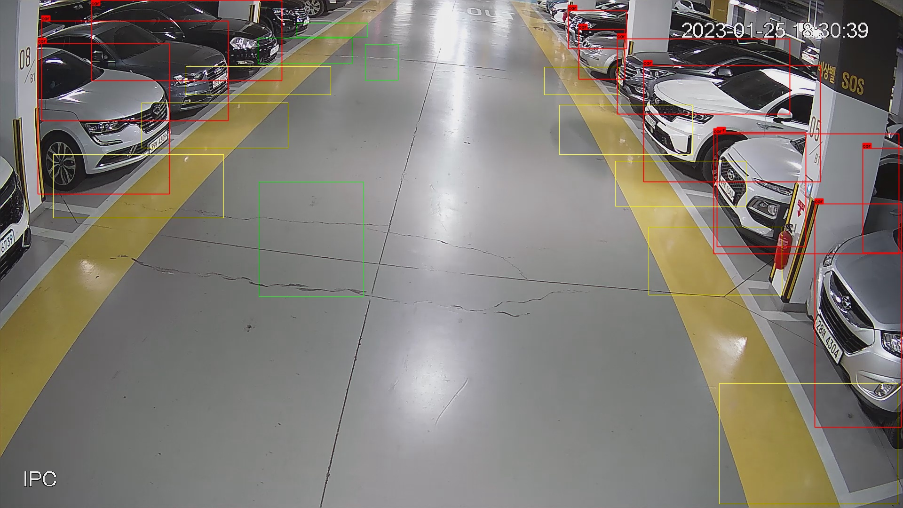

# Underground-Parking-Service
- This project is to make parkinglot service using camera. This makes it possible to determine the state of double parking, unlike determining the parking situation with a sensor.
- Detection
    - Object detection by yolov5
    - Tracking by opencv & StrongSORT
- Data Transmission
    - Mqtt


## Result


# Tested Environment
## Computer Server
- Linux & Vi editor
    - Intel Core i7-6700 @ 3.4GHz + NVIDIA GeForce GTX 2060 * 3
    - Responsible for over 200 cameras per server

# Usage
```
./main [input]
 - input:
    - use the default image file set in source code (main.cpp): blank
        - ./main
     - use video file: *.mp4, *.avi, *.webm
        - ./main test.mp4
     - use image file: *.jpg, *.png, *.bmp
        - ./main test.jpg
    - use camera: number (e.g. 0, 1, 2, ...)
        - ./main 0
```

- check runCheck.sh
- Reboot every 2 hours


# License


## Code, Library
- TensorFlow
    - https://github.com/tensorflow/tensorflow
    - Copyright 2019 The TensorFlow Authors
    - Licensed under the Apache License, Version 2.0
    - Generated pre-built library
- Pytorch
    - https://github.com/pytorch
    - Copyright (c) Soumith Chintala 2016, 
    - Licensed under the BSD 3-Clause License
    - Generated pre-built library

## Model
- YOLOv5
    - https://github.com/ultralytics/yolov5
    - Copyright (c) Megvii, Inc. and its affiliates. All Rights Reserved
    - Licensed under the GNU Affero General Public License v3.0
- StrongOSORT
    - https://github.com/mikel-brostrom/yolo_tracking
    - Copyright (C) 2007 Free Software Foundation
    - Licensed under the GNU Affero General Public License v3.0
